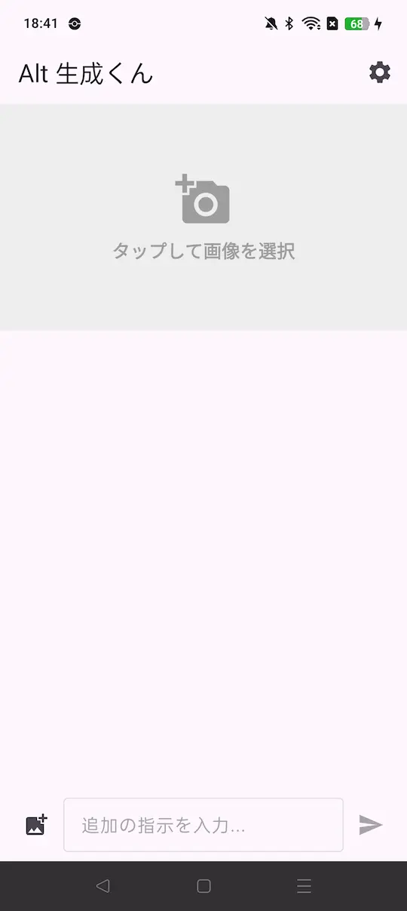
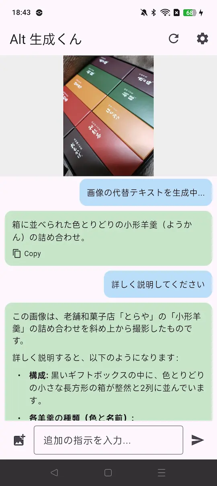

# Alt 生成くん (Alt Assistant App)

Gemini AIを活用して、画像の代替テキスト（Alt Text）を瞬時に生成し、AIと対話できるクロスプラットフォームアプリです。

## 概要

「Alt 生成くん」は、視覚情報を言語化する作業をAIの力で効率化します。画像をアップロードまたは撮影するだけで、アクセシビリティに配慮した詳細な説明文を生成します。

## スクリーンショット

| 初期画面 | 生成結果画面 |
| :---: | :---: |
|  |  |

## 主要機能

- **AIによる代替テキスト生成**: Googleの最新AI（Gemini）が画像を解析し、自然な日本語で説明文を作成します。
- **インテリジェント・フォールバック**: 3つのGeminiモデル（3-flash-preview, 2.5-flash, 1.5-flash）を階層的に管理。エラーが発生しても自動で次のモデルに切り替えてリトライします。
- **AIチャット機能**: 生成されたテキストに対して、「もっと短くして」「SNSの投稿文にして」など、チャット形式で追加の指示を出せます。
- **カメラ・ライブラリ対応**: 端末のフォトライブラリからの選択に加え、その場でのカメラ撮影にも対応。
- **セキュアな設定**: Gemini APIキーは端末内の安全なストレージ（Keychain/EncryptedSharedPrefs）に保存されます。

## 特徴

- **マルチプラットフォーム**: iOSおよびAndroidの両方に対応。
- **モダンなUI/UX**: 
  - 直感的な画像選択（中央エリアのタップ操作）
  - 生成状況のリアルタイム表示
  - 30秒のタイムアウト管理による安定した動作
  - システムナビゲーションバーを考慮したSafeArea設計

## セットアップ

### 必要条件
- [Flutter SDK](https://docs.flutter.dev/get-started/install)
- [Gemini API Key](https://aistudio.google.com/app/apikey)

### インストール
1. リポジトリをクローンします。
   ```bash
   git clone https://github.com/shodoi/alt-assistant-app.git
   ```
2. 依存関係をインストールします。
   ```bash
   flutter pub get
   ```
3. アプリを起動します。
   ```bash
   flutter run
   ```

## 技術スタック
- **Framework**: Flutter (Dart)
- **AI**: Google Generative AI (Gemini API)
- **Storage**: flutter_secure_storage
- **UI Components**: flutter_markdown, image_picker

---
Created with ❤️ by shodoi
